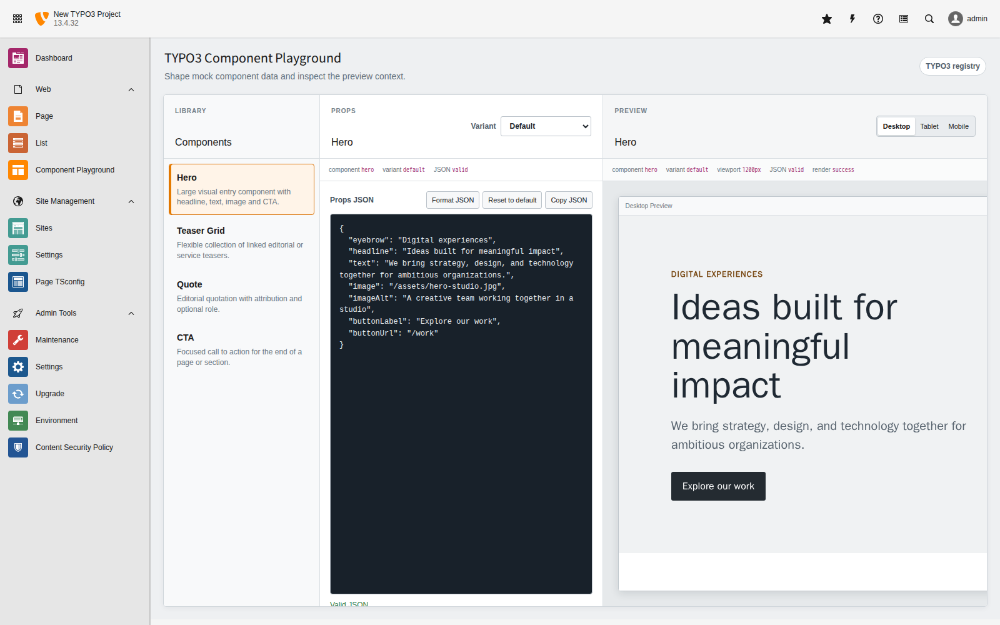
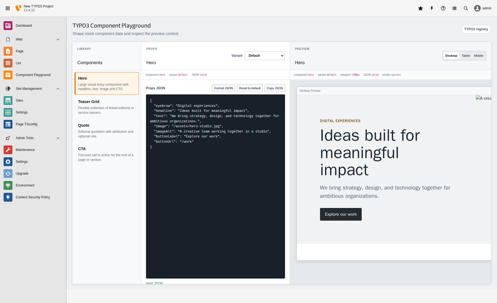
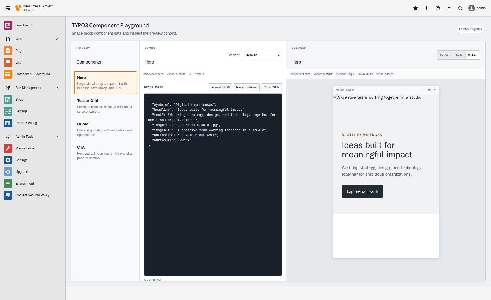
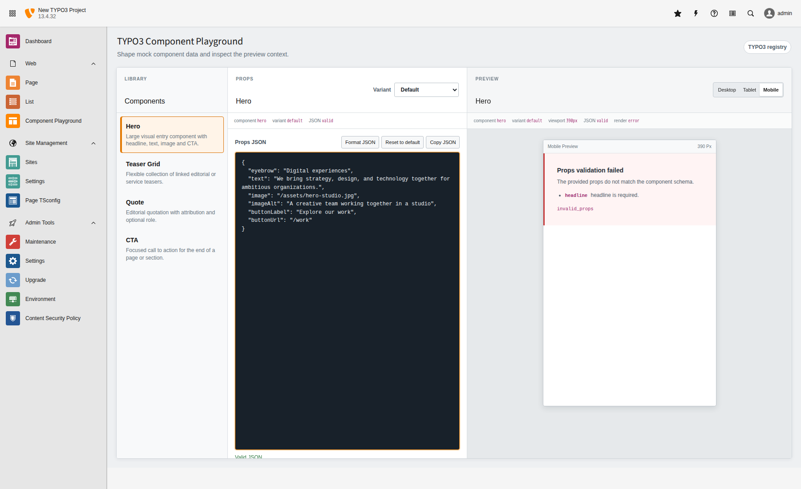
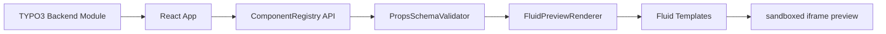

# TYPO3 Component Playground

TYPO3 Component Playground is a TYPO3 backend module for developing, testing, and previewing content components with mock JSON data.

The project solves a common agency workflow problem: developers often need to check how content elements behave with short text, long text, missing images, empty states, broken data, or mobile viewport constraints. Normally this requires creating real backend pages and content records. This extension provides an isolated playground inside the TYPO3 backend instead.

The MVP focuses on a controlled preview workflow:

- registered demo components
- editable JSON props
- server-side Fluid rendering
- sandboxed iframe preview
- responsive viewport switching
- schema validation
- backend route protection
- automated PHP and frontend tests

It intentionally avoids database persistence, real page records, content element storage, custom authentication, and Content Blocks auto-discovery in the first iteration.

## Setup assumptions

- PHP 8.2 or newer
- A Composer-based TYPO3 12.4 or 13.4 installation
- Node.js 20 or newer and npm
- This repository is installed as the `component_playground` extension, typically under `packages/component-playground`

Require the local extension through the TYPO3 project's Composer configuration:

```bash
composer req vendor/typo3-component-playground:@dev
```

Activate the extension if the installation does not use Composer mode activation.

Backend users need access to the **Web > Component Playground** module through TYPO3 backend group permissions.

## Local TYPO3 Setup with DDEV

Configure and start the local TYPO3 project, install its dependencies, and run the TYPO3 setup wizard:

```bash
ddev config --project-type=typo3 --docroot=public --php-version=8.2 --webserver-type=apache-fpm
ddev start
ddev composer install
ddev exec vendor/bin/typo3 setup
```

Use the DDEV database defaults during setup:

- host: `db`
- database: `db`
- username: `db`
- password: `db`
- port: `3306`

If `/typo3/login` returns `404`, install TYPO3's root Apache configuration and restart DDEV:

```bash
cp vendor/typo3/cms-install/Resources/Private/FolderStructureTemplateFiles/root-htaccess public/.htaccess
ddev restart
```

TYPO3 backend routes such as `/typo3/login` require the Apache rewrite rules provided by this `.htaccess` file.

## Backend App Build

The React source lives in `frontend/`. TYPO3 loads the compiled assets from `Resources/Public/BackendApp`, so build the production bundle before testing the app inside the TYPO3 backend:

```bash
cd frontend
npm install
npm run build
cd ..
ddev exec vendor/bin/typo3 cache:flush
```

The Vite development server is only for isolated frontend development unless explicit dev-server integration is added:

```bash
cd frontend
npm run dev
```

Vite writes `app.js`, `app.css`, and any supporting assets directly to `Resources/Public/BackendApp`.

Build artifacts are ignored and should be produced during packaging or deployment.

## Current scope

- TYPO3 12.4/13.4-compatible extension metadata and service configuration
- Backend module registration under the Web section
- TYPO3 module response containing a React mount point
- Typed React application with component sidebar, JSON editor, variant selector, viewport toggle, and sandboxed preview iframe
- PHP `ComponentRegistry` with explicit demo component metadata
- Server-side Fluid rendering for registered preview templates
- Per-component props schema validation
- Backend AJAX routes for component metadata and preview rendering
- Stable JSON error envelope for API errors
- Unit, functional, route-dispatch, security, and frontend tests
- GitHub Actions compatibility matrix for TYPO3 12.4 and 13.4 unit checks
- No database schema, persistence, custom authentication, real page records, or content-element persistence

## Local Demo Flow

Open the local TYPO3 backend at <https://typo3-project.ddev.site/typo3>, sign in, and navigate to **Web > Component Playground**.

Use this smoke-test flow:

1. Open Component Playground.
2. Select **Hero**.
3. Switch between its variants.
4. Edit the JSON props.
5. Switch between **Desktop**, **Tablet**, and **Mobile** viewports.
6. Remove a closing JSON brace and confirm that the client-side JSON error appears.
7. Restore valid JSON, remove a required prop such as `headline`, and confirm the backend `invalid_props` validation response.
8. Restore valid props and confirm that the Fluid preview renders again.

This validates the complete integration path:

```txt
TYPO3 backend module
→ React app
→ component registry route
→ JSON props validation
→ Fluid rendering route
→ sandboxed iframe preview
```

## Screenshots

Screenshots are stored under `Resources/Public/Documentation/screenshots/`.









The image files are intentionally not faked. See the note in the screenshot directory for the expected capture files.

## Architecture



- The backend module hosts the React mount point.
- React owns editor, variant, and viewport state.
- `ComponentRegistry` defines explicit MVP component metadata.
- `PropsSchemaValidator` validates incoming props before rendering.
- `FluidPreviewRenderer` renders only whitelisted templates.
- The preview iframe isolates rendered HTML and preview CSS from the TYPO3 backend UI.

## Component Registry

Component metadata currently lives in `Classes/Service/ComponentRegistry.php` and is exposed to the React module through an authenticated TYPO3 backend AJAX route.

The registry is intentionally explicit for the MVP: definitions are hardcoded, predictable, and have no persistence or file scanning. It can later be extended or replaced with Content Blocks auto-discovery once the component contract is stable.

The frontend retains local fixtures for isolated development only. To opt into them while running the Vite development server, set:

```bash
VITE_USE_MOCK_COMPONENTS=true
```

Production builds always use the TYPO3 registry.

## Preview Rendering

React sends the selected component key and the current valid props to the TYPO3 backend preview route.

The backend resolves that key through `ComponentRegistry` and only renders the template explicitly registered there. Request data can never select an arbitrary template or filesystem path.

Fluid preview templates live in:

```txt
Resources/Private/Templates/Preview
```

The independent preview stylesheet lives at:

```txt
Resources/Public/Preview/preview.css
```

The stylesheet is loaded inside a sandboxed iframe, preventing preview styles from leaking into the TYPO3 backend UI.

The API returns the rendered markup and stylesheet URL separately, and React assembles the isolated iframe document.

This MVP renders controlled fixture data directly through Fluid. It intentionally creates no TYPO3 pages, content elements, database records, or persistence layer.

## Preview Robustness

Rendered output is isolated in a script-free, sandboxed iframe whose document loads the dedicated preview stylesheet.

Registry variants intentionally cover realistic edge cases:

- long copy
- short content
- missing images
- missing actions
- small collections
- empty item lists
- long button labels
- optional metadata gaps

Debounced render requests use both cancellation and request sequence checks, preventing an older response from replacing newer preview output during rapid editing.

The JSON editor intentionally remains a lightweight textarea for the MVP, with formatting, reset, copy, and parse-error feedback rather than a full editor dependency.

## Props Schema Validation

Each component declares a small, explicit props schema alongside its metadata in `Classes/Service/ComponentRegistry.php`.

The backend validates required fields and the supported string, object, array, and nested item types before invoking Fluid.

Unknown fields remain allowed so developers can experiment without the MVP validator becoming unnecessarily restrictive.

Malformed JSON is handled immediately by the React editor and never reaches the render endpoint.

Syntactically valid JSON with props that do not match the selected component schema is rejected by the backend with HTTP `422`, the stable error code `invalid_props`, and field-level validation details.

This boundary keeps Fluid preview input predictable while preserving resilient templates for optional values.

Example validation error response:

```json
{
  "error": {
    "code": "invalid_props",
    "message": "The provided props do not match the component schema.",
    "details": [
      {
        "path": "headline",
        "code": "required",
        "message": "headline is required."
      }
    ]
  }
}
```

Error responses never include an `html` field.

## Backend Route Security

The component-list and preview-render endpoints are TYPO3 backend AJAX routes.

Both require:

- an authenticated backend session
- a valid TYPO3 route token
- access to the `web_componentplayground` backend module

Administrators and regular backend users with module permission can use the endpoints.

Authenticated users without that permission receive HTTP `403`.

The render endpoint does not persist data, but it remains protected because it accepts developer-controlled preview props and returns server-rendered HTML.

Route tokens are generated by TYPO3 and included in the URLs exposed through `TYPO3.settings.ajaxUrls`; the React application does not construct tokens itself.

## Testing

Install PHP dependencies:

```bash
composer install
```

Run PHP syntax checks:

```bash
composer lint:php
```

Run the fast PHP unit suite:

```bash
composer test:php:unit
```

Run TYPO3 functional tests:

```bash
composer test:php:functional
```

Run database-backed security functional tests:

```bash
composer test:php:security
```

Run all PHP test suites:

```bash
composer test:php
```

Install frontend dependencies and run frontend quality gates:

```bash
cd frontend
npm ci
npm run typecheck
npm run test
npm run build
```

Unit tests cover:

- registry contracts
- edge-case variants
- component lookup
- preview request validation
- stable error codes
- props schema validation
- template-name whitelisting
- template file contracts

Functional tests bootstrap TYPO3 and verify selected Hero, TeaserGrid, Quote, and CTA templates render real HTML, including missing optional data and empty-list fallbacks.

Real Fluid rendering belongs in the functional suite because its view factory, package paths, dependency injection, and Fluid runtime are provided by the TYPO3 bootstrap.

### Functional Route Dispatch Tests

The route-dispatch functional tests match the real `ajax_component_playground_preview_render` backend route and execute it through TYPO3's backend `RouteDispatcher`.

They cover:

- successful Fluid rendering
- schema-invalid props
- unknown components
- malformed JSON
- missing component keys
- non-object props

These tests complement the isolated request-validator units and renderer functional tests. They do not exercise React or browser behavior.

The route-dispatch suite intentionally disables database initialization. A persisted backend session and form-protection token are therefore unavailable, so only the matched test-request route is marked public before dispatch.

Route registration, HTTP method matching, dependency-injection controller resolution, request parsing, schema validation, component lookup, Fluid rendering, and JSON response formatting remain part of the test.

Authentication and module permission middleware are covered separately by the database-backed security functional suite.

### Security Functional Tests

Security functional tests use TYPO3's database-backed functional environment and full backend middleware stack.

Fixtures create:

- an administrator
- a regular backend user with Component Playground module access
- a regular backend user without Component Playground module access

The suite verifies:

- unauthenticated redirects or denial
- valid authenticated requests
- missing route tokens
- invalid route tokens
- inherited module permission decisions for both backend endpoints

Provide a MySQL-compatible test database through the standard TYPO3 Testing Framework variables:

```bash
typo3DatabaseDriver=pdo_mysql \
typo3DatabaseHost=127.0.0.1 \
typo3DatabasePort=3306 \
typo3DatabaseName=component_playground_test \
typo3DatabaseUsername=root \
typo3DatabasePassword=root \
composer test:php:security
```

These tests cover backend HTTP security behavior, not React or browser interaction.

### Frontend Tests

Frontend tests cover:

- JSON validation
- JSON editor actions
- preview loading, error, and success states
- stale request protection
- component loading
- empty registries
- retry behavior
- initial component selection
- backend validation error display

## Browser Smoke Test

The local Playwright smoke test exercises the documented demo flow through the real TYPO3 backend. It logs in, opens **Web > Component Playground**, verifies registry loading, switches a Hero variant and preview viewport, checks malformed JSON and backend `invalid_props` handling, and confirms that the Fluid preview recovers after valid props are restored.

The test lives in `frontend/tests/e2e/` and requires a running DDEV project plus a current backend app build. Install Playwright's Chromium browser once:

```bash
cd frontend
npx playwright install chromium
```

Provide backend credentials through environment variables; never store them in the repository. Run the smoke test headlessly:

```bash
cd frontend
TYPO3_E2E_ADMIN_USER=e2e-admin TYPO3_E2E_ADMIN_PASSWORD='...' npm run test:e2e:smoke
```

Run the same flow with a visible browser for local diagnosis:

```bash
cd frontend
TYPO3_E2E_ADMIN_USER=e2e-admin TYPO3_E2E_ADMIN_PASSWORD='...' npm run test:e2e:headed
```

The Playwright smoke test is intentionally not part of CI yet. It will be added once database-backed TYPO3 setup in CI is reliable.

## Deterministic Local E2E Bootstrap

The local bootstrap prepares a repeatable TYPO3 state before the browser tests. It starts or verifies DDEV, installs missing Composer dependencies, applies TYPO3 extension and database schema setup, recreates the three named E2E users and their permission groups, builds the React backend assets, and flushes TYPO3 caches.

This command changes local test state: it removes stale sessions and recreates only the configured E2E users plus the `e2e-component-playground-users` and `e2e-restricted-users` groups. It does **not** drop the database, remove unrelated users or groups, or delete page content.

Create the ignored local environment file and replace the example password:

```bash
cp .env.e2e.example .env.e2e
```

Run the bootstrap through the frontend package:

```bash
cd frontend
npm run e2e:bootstrap
```

The Playwright configuration loads `../.env.e2e` automatically, so the prepared smoke test can then run headlessly or headed:

```bash
npm run test:e2e
npm run test:e2e:headed
```

Environment variables supplied by the shell take precedence over `.env.e2e`. The previous `TYPO3_E2E_USER`, `TYPO3_E2E_PASSWORD`, `TYPO3_BACKEND_USER`, and `TYPO3_BACKEND_PASSWORD` names remain supported for the admin smoke user. New local setups should use the explicit admin, allowed, and restricted variables from `.env.e2e.example`.

The browser smoke test is intentionally not part of CI until the TYPO3 database setup, backend user provisioning and route-token handling are fully deterministic in CI. The local bootstrap establishes reproducibility before that database-backed CI work begins.

## Local E2E Authorization Test

The focused authorization test proves that the backend module is permission-aware inside TYPO3 without attempting to retest TYPO3's complete access-control system.

The deterministic bootstrap provisions:

- `e2e-admin`: administrator used by the full local smoke test
- `e2e-playground`: regular backend user assigned to `e2e-component-playground-users`, whose `groupMods` includes `web_componentplayground`
- `e2e-restricted`: regular backend user assigned to `e2e-restricted-users`, whose `groupMods` excludes `web_componentplayground`

Prepare the users and groups, then run the focused authorization spec:

```bash
cd frontend
npm run e2e:bootstrap
npm run test:e2e:auth
```

Run the existing full flow separately with the admin E2E user:

```bash
npm run test:e2e:smoke
```

The authorization test verifies that the allowed regular user can open the module and load its React app, while the restricted regular user neither sees the module navigation entry nor loads the module through its direct route. It remains intentionally local-only and is not part of CI yet.

## Local E2E Quality Gate

Run the complete local browser verification in one command. The quality gate executes, in order:

1. deterministic TYPO3 E2E bootstrap
2. focused authorization test
3. full Component Playground smoke test

Create the ignored environment file once and replace all example passwords:

```bash
cp .env.e2e.example .env.e2e
# edit .env.e2e
```

Then run:

```bash
cd frontend
npm run e2e:local
```

Both the bootstrap and Playwright configuration load the root `.env.e2e` file automatically. Shell environment variables still take precedence, so no manual `source` command is required.

This quality gate is intentionally local-only and is not part of CI yet. It is the reproducibility step before database-backed TYPO3 browser testing is integrated into CI.

If `e2e:local` fails:

- verify DDEV is available and the TYPO3 backend is reachable
- rerun `npm run e2e:bootstrap`
- inspect the HTML report with `npx playwright show-report`
- run the failing spec in headed mode:

```bash
npm run test:e2e:auth -- --headed
npm run test:e2e:smoke -- --headed
```

## Compatibility

TYPO3 Component Playground is tested against:

- TYPO3 12.4 LTS
- TYPO3 13.4 LTS
- PHP 8.2

The current GitHub Actions compatibility matrix validates:

- Composer metadata
- TYPO3 12.4 dependency resolution
- TYPO3 13.4 dependency resolution
- PHP syntax checks
- PHP unit tests against both TYPO3 versions

Current matrix jobs:

```txt
PHP 8.2 / TYPO3 12.4
PHP 8.2 / TYPO3 13.4
```

Frontend checks run separately because the React/TypeScript backend app is independent from the installed TYPO3 core version.

Composer advisory blocking is disabled only inside the compatibility matrix install step so older TYPO3 12.4 packages can be resolved for compatibility testing. This does not replace security auditing for production installations.

Functional and database-backed security suites exist as local commands and run in the separate database-backed quality workflow. They do not currently run across the TYPO3 compatibility matrix and can be added later once database-backed matrix CI is intentionally configured.

## CI

The TYPO3 12.4/13.4 GitHub Actions matrix validates:

- Composer metadata
- TYPO3 12.4 dependency resolution
- TYPO3 13.4 dependency resolution
- PHP syntax checks
- PHP unit tests against both TYPO3 versions

Separate quality jobs validate:

- the functional and security suites against the repository's locked TYPO3 dependency set
- frontend type checks
- frontend tests
- frontend production build

The TYPO3 compatibility matrix intentionally focuses on fast feedback and package compatibility. Functional and security suites exist as local commands and can be added to that matrix later once database-backed CI is intentionally configured.

## Next implementation steps

1. Add Content Blocks discovery behind the existing registry contract.
2. Extend the TYPO3 compatibility matrix to run functional and security suites against TYPO3 12.4 and 13.4.
3. Add browser-level smoke tests for the documented local demo flow.

## Project Positioning

TYPO3 Component Playground solves a real TYPO3 agency workflow problem: developers need to test content-component edge cases without changing real pages or content records. It acts as a TYPO3-specific component playground rather than a generic component catalogue.

The project demonstrates:

- TYPO3 extension and backend module development
- Fluid templates and backend routing
- React and TypeScript state management
- server-side props validation and controlled rendering
- PHP and frontend testing
- compatibility-focused CI

It is intentionally scoped as a one-to-two-week MVP rather than an overbuilt platform. The explicit registry, mock-data workflow, and absence of persistence keep the implementation focused on the core developer experience.

## Interview Pitch

TYPO3 Component Playground is a backend module for previewing content components with mock data before editors create real pages. It helps developers test edge cases such as long text, missing images, empty states and mobile layouts directly inside TYPO3. Technically, it combines a TYPO3 backend module, explicit component registry, schema validation, Fluid rendering and a React/TypeScript interface with sandboxed previews.
